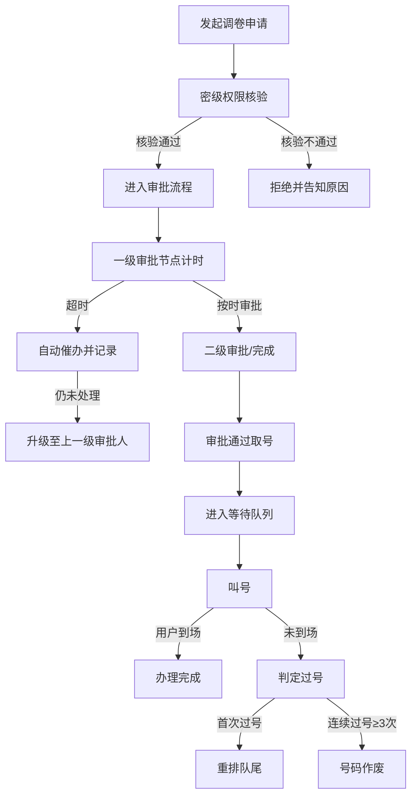

## 1. 产品概述
档案借阅调卷管理系统是面向档案馆、政府机关、企事业单位档案管理部门的纯前端应用，用于规范档案调卷审批流程、管理查档高峰期的排队叫号秩序，以及处理审批超时催办和过号问题。

- 解决问题：调卷审批流程不透明、超时处理无记录、查档高峰秩序混乱、过号规则不统一
- 目标用户：档案管理员、审批人员、查档用户

## 2. 核心功能

### 2.1 用户角色
| 角色 | 说明 | 核心权限 |
|------|------|----------|
| 查档用户 | 发起调卷申请的人员 | 发起调卷事由、取号排队、查看审批状态 |
| 审批人员 | 各审批节点的处理人 | 审批调卷申请、查看催办通知、记录审批意见 |
| 档案管理员 | 系统运营管理人员 | 管理队列叫号、处理过号、查看全流程记录 |

### 2.2 功能模块
1. **调卷审批模块**：调卷事由发起、审批流程节点、密级权限核验、审批轨迹留痕
2. **超时催办模块**：节点超时计时、自动升级催办、催办记录、责任人追踪
3. **排队叫号模块**：取号排队、当前叫号显示、队列状态管理、叫号操作
4. **过号处理模块**：过号判定、过号重排队尾、连续过号作废、过号记录

### 2.3 页面详情
| 页面名称 | 模块名称 | 功能描述 |
|-----------|-------------|---------------------|
| 首页/工作台 | 数据概览 | 待审批数、待叫号数、超时预警数、今日过号数统计卡片 |
| 调卷审批 | 发起调卷 | 表单填写调卷事由、档案编号、密级选择、借阅期限 |
| 调卷审批 | 审批列表 | 待审批、审批中、已通过、已拒绝状态筛选与列表展示 |
| 调卷审批 | 审批详情 | 审批节点时间线、密级核验结果、操作按钮（通过/驳回/转办） |
| 超时催办 | 超时监控 | 实时倒计时显示、节点超时状态、预警颜色标识 |
| 超时催办 | 催办记录 | 催办历史、升级路径、责任人签收记录 |
| 排队叫号 | 取号界面 | 用户取号按钮、号码生成、预计等待时间 |
| 排队叫号 | 叫号大屏 | 大号显示当前叫号、下一位提示、队列列表 |
| 排队叫号 | 叫号管理 | 叫号/重叫/跳过操作、叫号历史记录 |
| 过号处理 | 过号列表 | 过号记录展示、重排操作、作废判定 |
| 过号处理 | 连续过号监控 | 用户过号次数统计、自动作废触发 |

## 3. 核心流程

### 3.1 调卷审批流程
查档用户填写调卷事由并提交 → 系统核验档案密级与用户权限 → 权限通过则进入审批队列 → 一级审批节点（计时开始）→ 审批通过进入下一级/超时则触发催办→ 全部审批通过 → 取号排队

### 3.2 排队叫号流程
审批通过用户取号 → 进入等待队列 → 叫号员叫号 → 用户应号办理 → 叫到未到场判定过号 → 过号重排队尾/连续过号作废

### 3.3 流程图

## 4. 用户界面设计

### 4.1 设计风格
- **主色调**：档案蓝 (#1e40af) 作为主色，代表专业、可信、稳重
- **辅助色**：警示橙 (#f97316) 用于超时预警，成功绿 (#10b981) 用于通过状态，危险红 (#ef4444) 用于作废/拒绝
- **中性色**：以 slate 色系为基础，配合深浅层次构建专业感
- **按钮风格**：采用圆角(8px)设计，主按钮填充色，次按钮描边风格
- **字体**：Noto Sans SC 中文显示字体 + JetBrains Mono 等宽字体（用于编号、时间等数据展示）
- **布局风格**：顶部导航 + 左侧模块菜单 + 右侧内容区的经典后台布局
- **图标风格**：使用 lucide-react 线性图标，保持统一简洁

### 4.2 页面设计概览
| 页面名称 | 模块名称 | UI元素 |
|-----------|-------------|-------------|
| 工作台 | 数据概览 | 4张统计卡片（数字+趋势箭头+图标）、待办事项列表、超时预警条 |
| 调卷审批 | 发起表单 | 分区表单卡片、密级选择器（带颜色标识）、文件上传区域、提交按钮 |
| 调卷审批 | 审批详情 | 左侧档案信息卡、右侧审批时间线（带状态颜色节点）、底部操作栏 |
| 超时催办 | 超时监控 | 卡片式节点展示、实时倒计时（红色闪烁动画）、进度条、催办历史时间线 |
| 排队叫号 | 叫号大屏 | 大号数字显示（8rem以上字号）、脉冲动画、队列进度条、喇叭图标 |
| 过号处理 | 过号列表 | 表格展示、过号次数徽章（颜色递增）、操作按钮组、作废标记 |

### 4.3 响应式
- 桌面端优先设计（1440px基准）
- 叫号大屏支持全屏展示模式
- 平板端自适应内容区宽度
- 移动端简化侧边栏为抽屉式导航
