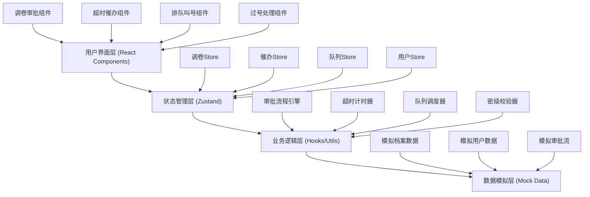
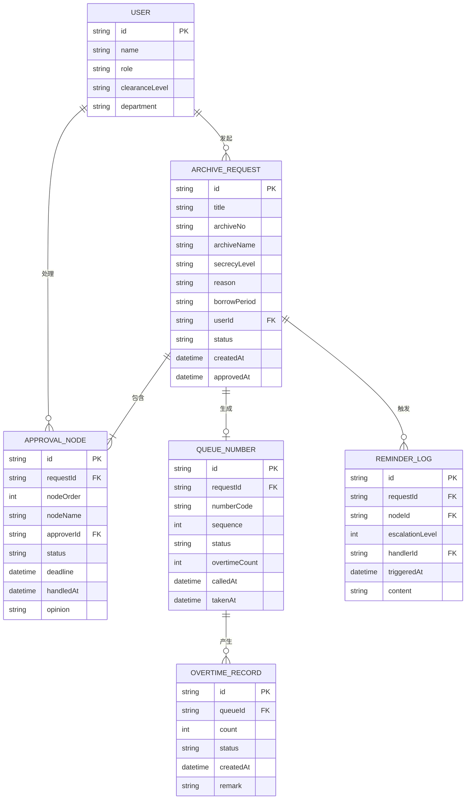

## 1. 架构设计



## 2. 技术描述
- **前端框架**：React@18 + TypeScript@5
- **构建工具**：Vite@5
- **样式方案**：TailwindCSS@3
- **状态管理**：Zustand@4
- **路由管理**：React Router DOM@6
- **图标库**：lucide-react
- **后端**：纯前端应用，无后端服务，使用Mock数据模拟
- **数据持久化**：localStorage 存储状态

## 3. 路由定义
| 路由 | 页面/组件 | 用途 |
|-------|-----------|---------|
| /dashboard | Dashboard 工作台 | 数据概览、待办提醒、预警通知 |
| /approval | ApprovalList 调卷审批列表 | 展示所有调卷申请，状态筛选 |
| /approval/new | ApprovalNew 发起调卷 | 填写调卷事由，发起新申请 |
| /approval/:id | ApprovalDetail 审批详情 | 审批详情页，含时间线和操作 |
| /reminder | ReminderCenter 超时催办 | 超时监控、催办记录、升级处理 |
| /queue | QueueBoard 排队叫号大屏 | 大屏幕展示当前叫号和队列 |
| /queue/manage | QueueManage 叫号管理 | 叫号操作、队列管理 |
| /queue/take | TakeNumber 取号界面 | 用户取号页面 |
| /overtime | OvertimeHandle 过号处理 | 过号列表、重排、作废操作 |

## 4. 数据模型

### 4.1 数据模型ER图


### 4.2 核心数据定义

```typescript
// 档案密级
type SecrecyLevel = 'public' | 'internal' | 'secret' | 'top-secret';

// 用户角色
type UserRole = 'requester' | 'approver' | 'admin';

// 审批节点状态
type NodeStatus = 'pending' | 'approved' | 'rejected' | 'timeout' | 'escalated';

// 调卷申请状态
type RequestStatus = 'draft' | 'checking' | 'approving' | 'approved' | 'rejected' | 'queuing' | 'completed';

// 队列号码状态
type QueueStatus = 'waiting' | 'calling' | 'processing' | 'passed' | 'invalid';

// 调卷申请
interface ArchiveRequest {
  id: string;
  title: string;
  archiveNo: string;
  archiveName: string;
  secrecyLevel: SecrecyLevel;
  reason: string;
  borrowPeriod: string;
  userId: string;
  userName: string;
  userDepartment: string;
  userClearance: SecrecyLevel;
  status: RequestStatus;
  currentNode: number;
  createdAt: number;
  approvedAt?: number;
}

// 审批节点
interface ApprovalNode {
  id: string;
  requestId: string;
  nodeOrder: number;
  nodeName: string;
  approverId: string;
  approverName: string;
  status: NodeStatus;
  deadline: number;
  handledAt?: number;
  opinion?: string;
  timeoutMinutes: number;
}

// 催办记录
interface ReminderLog {
  id: string;
  requestId: string;
  nodeId: string;
  escalationLevel: number;
  handlerId: string;
  handlerName: string;
  triggeredAt: number;
  content: string;
  acknowledged: boolean;
}

// 队列号码
interface QueueNumber {
  id: string;
  requestId: string;
  numberCode: string;
  sequence: number;
  status: QueueStatus;
  userId: string;
  userName: string;
  overtimeCount: number;
  calledAt?: number;
  takenAt: number;
  completedAt?: number;
}

// 过号记录
interface OvertimeRecord {
  id: string;
  queueId: string;
  numberCode: string;
  userName: string;
  count: number;
  status: 'requeued' | 'invalid';
  createdAt: number;
  remark: string;
}
```

## 5. 核心业务逻辑

### 5.1 密级权限核验规则
- 用户权限等级 >= 档案密级等级方可申请
- 等级映射：public(0) < internal(1) < secret(2) < top-secret(3)
- 核验不通过直接拒绝，记录拒绝原因

### 5.2 超时催办规则
- 每个审批节点设置超时时间（一级节点30分钟，二级节点60分钟）
- 超时后触发第一级催办（站内消息通知审批人）
- 超时×2后升级至上一级主管
- 超时×3后升级至档案部门负责人
- 每次催办记录责任人、时间、升级层级

### 5.3 过号处理规则
- 叫号后3分钟内未到场判定过号
- 首次过号：号码移至队尾，过号次数+1
- 二次过号：号码移至队尾，过号次数+1，提示警告
- 连续三次过号：号码自动作废，需重新取号
- 过号记录永久保存，可追溯查询
